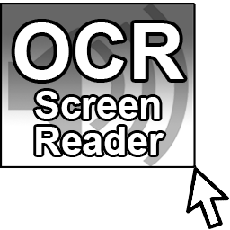

# PennApps 2018 - OCR Screen Reader

Windows application written in Python that reads any part of the screen that the user selects using OCR with Tesseract.

**tesseract\tesseract.exe** must be in Windows path to work.

Right-click tray icon to activate or press **Alt + X**

### Credits

Steve Kraft https://github.com/steven-kraft

Noah Eng https://github.com/noaheng

Josh Coneby https://github.com/jmconeby

Made at PennApps 2018

